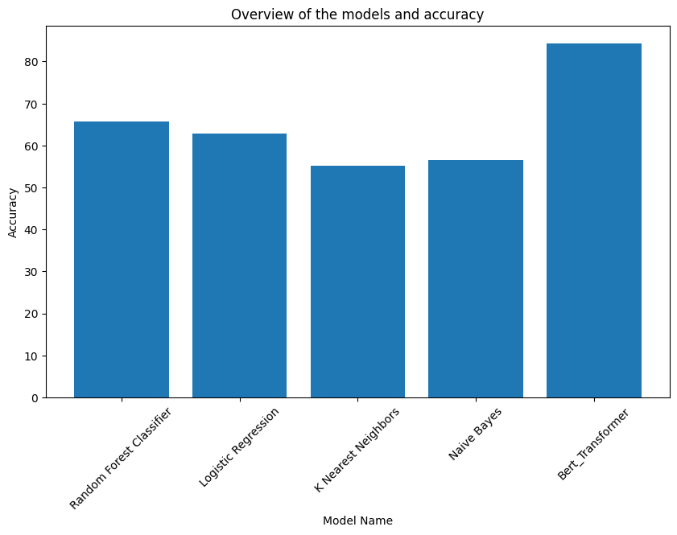

<div align="center">

# Resume Categorization

</div>

## Overview
This project utilizes Machine Learning and NLP to automate resume classification, streamlining the review process. By training BERT, a state-of-the-art language model, on resume data, it learns to identify key features for different job categories, ensuring efficient and accurate resume sorting for recruitment. Additionally, the performance of BERT is compared with traditional models like Random Forest, Logistic Regression, K-Nearest Neighbors, and Naive Bayes to evaluate accuracy and effectiveness in categorizing resumes.

## Installation

#### Step 1: Clone this repository
```bash
git clone https://github.com/syk096/resume_categorization.git
cd resume_categorization
```
#### Step 2: Create virtual environment

*Conda environment:*
```
conda create -n resume_categorization python==3.9.0
conda activate resume_categorization
```
#### Step 3: Install dependencies

```bash
pip install -r requirements.txt
```
> Run the [`eda.ipynb`](eda.ipynb) file in jupyter notebook to get preprocessing steps, data augmentation, and exploratory data analysis.

> Run the [`training_script.ipynb`](model.ipynb) file in jupyter notebook to get the bert based multi-class classification model.


## Datasets
I have used the dataset that has been given in the attachment.

Also i augmented few dataset to overcome overfitting issue


 ## Inferance

 Firstly download the checkpoint from this [Link](https://drive.google.com/file/d/1eeFyzEU7Dk7BV3E0wIimouOrNdNz6iFP/view?usp=sharing) and create a model directory and move it to that directory.

 **Must be set the model path in the script.py in **model_path** variable of main function.

Also add a argument of your resume dir in replace with <'path/to/resume/pdfs'>
 then run below script 

 ```bash
python script.py path/to/resume/pdfs
```


> By running the script will create a folder named ```categorized_resume``` and  move the resumes from the ```file_path``` to the respective folders according to the category of the resume and will create a `categorize_resume.csv` file in the current directory.

## Training results
I have initially split the dataset into a training set, validation set and a test set using an 80:10:10 ratio. Subsequently, I observed that the training dataset was imbalanced. To address this imbalance, I performed data augmentation on a portion of the training data, resulting in a more balanced training set. However, it's important to note that the validation and test dataset remained unchanged and was not subjected to any augmentation. This experiment is on BERT model
#### Below picture illustrating Train vs Test accuracy graph

#### Below picture illustrating the training loss graph


## Performanca on different ML method with BERT



**That's why I choose BERT model for this experiment**

## Performance
I evaluated the performance of my BERT model on a separate set of Test samples that were not included in the training dataset. Below table presenting the evaluation table.

| Evaluation metrics     | score       |
| -----------            | ----------- |
| Accuracy               | 84.34%         |
| Precision              | 83.75%         |
| recall                 | 84.34%         |
| F1                     | 83.63%         |
